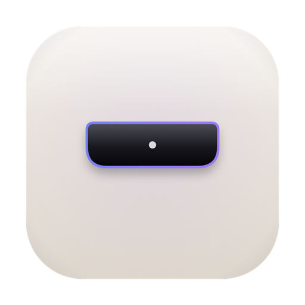

<div align="center">



# FocusNotch

**Make your MacBook's notch useful — a Pomodoro timer that lives in the notch.**

When you're not looking, FocusNotch shows the time left in your session on the
left of the notch and your session progress on the right. Hover over it and the
notch expands into a full control panel: a hero countdown, a progress bar,
session tracker, transport controls, and a one-tap Do Not Disturb toggle.

</div>

---

## Features

- 🎯 **Notch-native UI** — a panel pinned over the physical notch that floats above every Space and over fullscreen apps. It's click-through when collapsed, so your menu bar keeps working.
- ⏳ **At-a-glance status** — remaining time on the left of the notch, session dots on the right.
- 🖱️ **Hover to expand** — smooth spring animation into a progress ring, "Session X of Y", next-phase preview, and Start / Pause / Skip / Reset controls.
- 🍅 **Real Pomodoro engine** — configurable focus / short break / long break durations, sessions-before-long-break cycles, and optional auto-start. Timing is anchored to an absolute end date, so it stays accurate across sleep and timer coalescing.
- 🌙 **Focus / Do Not Disturb** — automatically enable a macOS Focus while you work, via the Shortcuts app (see [Focus setup](#focus--do-not-disturb-setup)).
- 🔔 **Notifications & sounds** on every phase change.
- 📊 **Menu bar item** mirroring the timer, with the same controls — handy on external displays.
- 🚀 **Launch at login** (via `SMAppService`).
- 🖥️ **Works without a notch** — optionally shows a simulated "island" at the top-center of any Mac.

## Requirements

- macOS 14 (Sonoma) or later
- Xcode 16+ (developed with Xcode 26)
- [XcodeGen](https://github.com/yonyz/XcodeGen) (`brew install xcodegen`) to generate the project

## Build & run

```bash
# 1. Generate the Xcode project from project.yml
xcodegen generate

# 2. Open it
open FocusNotch.xcodeproj

# 3. Select the "FocusNotch" scheme and press ⌘R
```

Or build entirely from the command line:

```bash
xcodegen generate
xcodebuild -project FocusNotch.xcodeproj -scheme FocusNotch -configuration Release build
```

> FocusNotch is an **agent app** (`LSUIElement`) — it has no Dock icon. After
> launching, look for the timer in your menu bar and the panel over your notch.
> Quit it from the menu bar item.

### Regenerating the app icon

The icon is generated from code so there are no binary assets to hand-edit:

```bash
bash Tools/make_icons.sh
```

## Focus / Do Not Disturb setup

Apple provides no public API to toggle Focus, so FocusNotch runs a **Shortcut**
that accepts `on`/`off` via standard input. It defaults to the free
[`macos-focus-mode`](https://github.com/sindresorhus/macos-focus-mode) shortcut:

```bash
npx macos-focus-mode install
```

That installs a shortcut named `macos-focus-mode`. The moon button on the notch
then toggles Do Not Disturb; enable **Settings → Focus → "Enable Do Not Disturb
during focus sessions"** to have it follow your work sessions automatically.

Prefer your own shortcut? Create one that takes text input and runs **Set Focus
→ Do Not Disturb**, then set its name in **Settings → Focus**. The first time
the app runs it, macOS asks once to allow FocusNotch to run the shortcut.

## Architecture

```
Sources/
├── App/            App lifecycle, shared environment
├── Pomodoro/       PomodoroEngine (state machine), PomodoroSettings, PomodoroPhase
├── Focus/          FocusController (Shortcuts CLI bridge)
├── System/         Notifications, sounds, launch-at-login, NSScreen+notch, formatting
├── Notch/          NotchWindow (NSPanel), NotchController (hover state machine),
│                   NotchGeometry, NotchModel, status bar + settings window controllers
└── Views/          SwiftUI: NotchShape, NotchRootView, Closed/Open notch views,
                    reusable components, SettingsView
```

**How the notch panel works.** A borderless, non-activating `NSPanel`
(`Sources/Notch/NotchWindow.swift`) is pinned over the notch at the `.statusBar`
window level with an all-Spaces collection behavior. `NotchController` tracks the
cursor with paired global + local `NSEvent` monitors (needed because the panel
toggles `ignoresMouseEvents` between collapsed/expanded), and flips an observable
`isOpen` flag. The SwiftUI `NotchRootView` animates the `NotchShape` and content
between the two states.

## Building a release (DMG)

FocusNotch ships as a **direct download** (notarized DMG), not the Mac App Store,
because Do Not Disturb runs the `shortcuts` CLI — which the App Store sandbox
forbids. The whole pipeline (build → sign → DMG → notarize → staple) is one
command:

```bash
FN_SIGN_ID="Developer ID Application: Your Name (TEAMID)" \
FN_NOTARY_PROFILE="FocusNotchNotary" \
./scripts/release.sh
# → dist/FocusNotch-<version>.dmg  (signed, notarized, stapled)
```

Omit `FN_NOTARY_PROFILE` to build a signed-but-un-notarized DMG for local testing.

**One-time prerequisites for notarization:**

1. A **paid Apple Developer Program** membership.
2. A **Developer ID Application** certificate — Xcode → Settings → Accounts →
   Manage Certificates → **+** → *Developer ID Application*.
3. A notarytool **keychain profile** (stores your credentials once):
   ```bash
   xcrun notarytool store-credentials "FocusNotchNotary" \
     --apple-id "you@example.com" --team-id "YOURTEAMID" \
     --password "app-specific-password"   # create at appleid.apple.com
   ```

Hardened Runtime is already enabled, and `--timestamp --options runtime` are
applied by the script — the requirements notarization checks for.

> Mac App Store instead? Enable App Sandbox in
> `Sources/Resources/FocusNotch.entitlements` and replace the `shortcuts`-based
> Focus integration in `FocusController` with an App Intent.

## License

Released under the [MIT License](LICENSE) — good for open-sourcing. If you intend
to **sell a closed-source build**, replace `LICENSE` with your own commercial /
EULA terms before distributing. Fill in `<YOUR NAME>` in the license header
either way.
